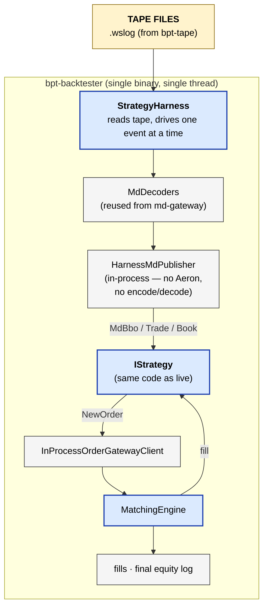

# bpt-backtester

Deterministic single-process backtest harness. Strategy code + matching
engine + tape replay all run in one thread — no Aeron, no IPC, no
scheduler jitter. Same input always produces the same output, which is
what parameter sweeps need.

The legacy multi-process backtester (Aeron-driven, Arrow/Parquet tape
loader) was retired 2026-05-20 — live testnet trading covers the
integration-smoke role at higher fidelity, and the parameter-tuning
role moved entirely to this single binary.

See [service-anatomy.md](../docs/service-anatomy.md) for the canonical
service shape.

## At a glance



## Layers

The harness is a small library that wires strategy + matching engine +
tape replay end-to-end.

| Layer | Notes |
|---|---|
| Composition root | `src/main.cpp` — CLI parsing, opts → harness |
| Harness | `harness/strategy_harness.{h,cpp}` — drives replay |
| In-process clients | `harness/inprocess_order_gateway_client.{h,cpp}`, `strategy/md/inprocess_md_client.h`, `strategy/refdata/inprocess_refdata_client.h` |
| MdPublisher (in-process) | `harness/harness_md_publisher.h` |
| Tape reader | `harness/wslog_reader.h` |
| Matching engine | `matching/matching_engine.{h,cpp}` |
| Results | `results/results_collector.{h,cpp}` |
| Latency model | `latency/latency_model.h` |

## Reading order

1. `src/main.cpp`
2. `harness/strategy_harness.{h,cpp}` — the in-process driver.
3. `harness/inprocess_order_gateway_client.{h,cpp}` — strategy's order
   client without Aeron.
4. `harness/harness_md_publisher.h` — replaces the live `MdPublisher` chain.
5. `matching/matching_engine.{h,cpp}` — per-instrument order book + fill logic.

## Build

```bash
bazel build //bpt-backtester:bpt-backtester
bazel test  //bpt-backtester:backtester_unit_tests
```

## Run

```bash
bazel-bin/bpt-backtester/bpt-backtester \
  --strategy-config       bpt-strategy/config/avellaneda_stoikov.qa-hyperliquid.toml \
  --instrument-mapping    config/instruments/instrument_mapping.hyperliquid.json \
  --wslog                 /path/to/tape1.wslog /path/to/tape2.wslog \
  --output-dir            results \
  --starting-capital      1000 \
  --strategy-name         AvellanedaStoikov
```

Output: per-run directory under `--output-dir` containing `summary.json`,
`trades.csv`, `pnl_curve.csv`. The run-id is composed from
`--strategy-name`, `--params-hash`, `--git-sha`, and the start/end
timestamps in the tape.

## Status

HL backtester end-to-end (`.wslog` from bpt-tape's HL capture) is the
proven path — see `project_hl_backtester_support` in repo memory. Other
venues land as bpt-tape adds capture coverage for them.
