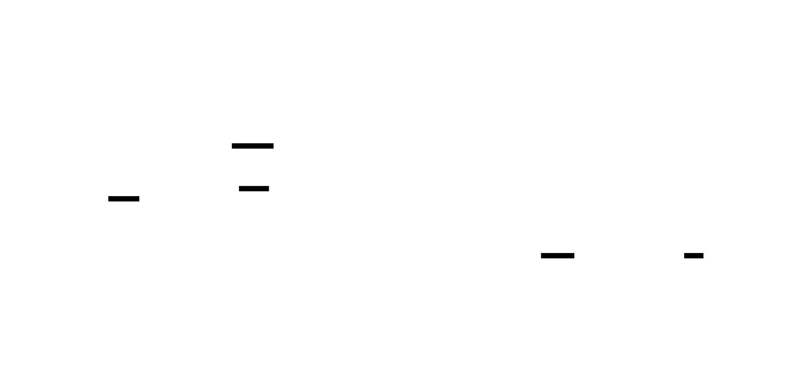
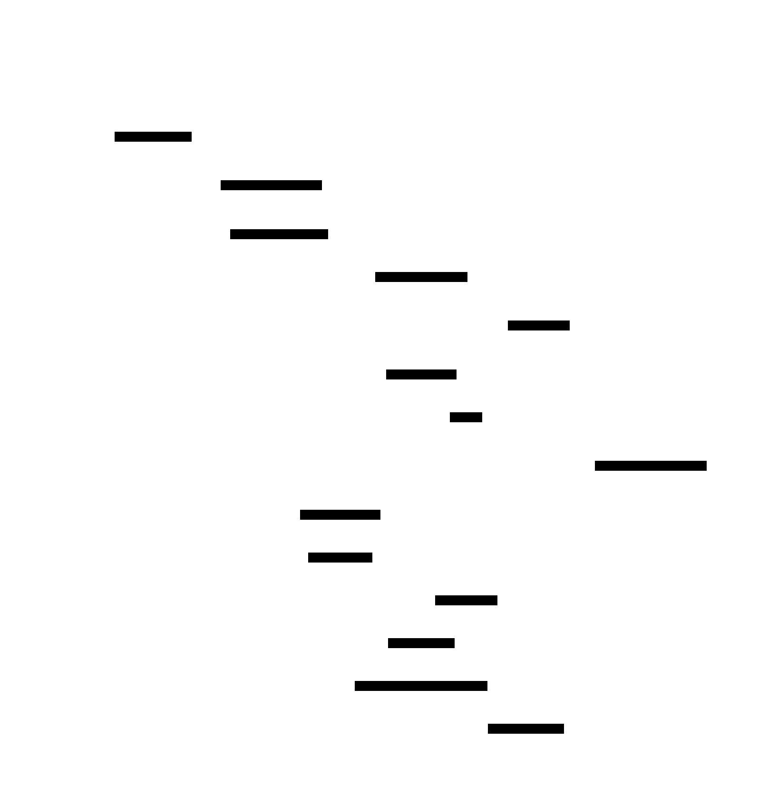
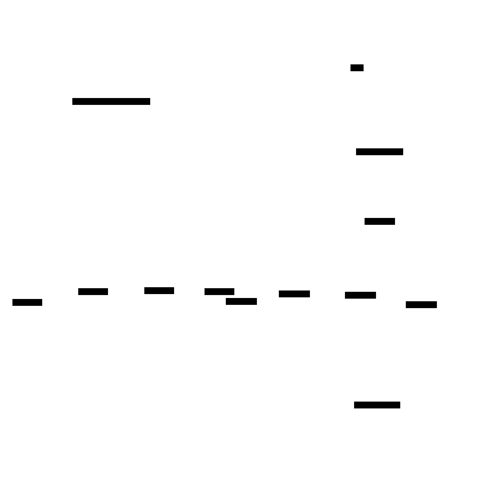

# Architecture

Diagrams here complement the high-level overview in the [README](../README.md). Sources are D2 (`docs/diagrams/*.d2`) — re-render with `d2 docs/diagrams/foo.d2 docs/diagrams/foo.svg` after edits.

## System overview

The whole stack at a glance: exchange venues on one side, the React console on the other, every C++ service multiplexed over an Aeron fabric in the middle.

  

The Aeron MediaDriver runs as an external JVM process (rather than embedded in any C++ service) so its garbage collection can never stall the hot path. Every inter-service message is SBE-encoded — zero-copy on the C++ side.

## Tick → order → fill

A single market-data update through to fill, showing the message hops and the work each service does. The strategy → order-gateway round-trip is measured at ~150µs p50 / 524µs max on commodity hardware.

  

The path is intentionally short: no broker, no internal queueing layer, no thrift / gRPC hop. Strategies subscribe to the same SBE-decoded view of the market that the gateway publishes, and ship `OrderRequest` straight back over the same fabric. The order-gateway owns risk + circuit-breakers — there's no separate risk service in the hot path.

## Configuration topology

The deploy story is built around three "single sources of truth" plus one coherence-checking gate. Misconfiguration is caught at boot (or earlier, when `switch-env.sh` lints the env file) rather than mid-trading.

  

- **`deploy/config/aeron/streams.toml`** owns every Aeron stream ID. Services reference streams by global name; a typo fails at boot instead of silently subscribing to the wrong topic.
- **`deploy/config/profile/<tag>.toml`** owns environment + exchange filter + endpoints path. Each service config references it as `profile_config = "..."`.
- **`deploy/env/<stack>.env`** is the per-stack environment file; `switch-env.sh` symlinks the active one and refuses to activate any env whose services disagree on profile.
- **systemd user units** read the env file at start; they don't bake any config into the unit itself.

This eliminates the "stack started on different exchanges" and "two services subscribed to mismatched stream IDs" classes of failure that bite multi-service systems early on.
