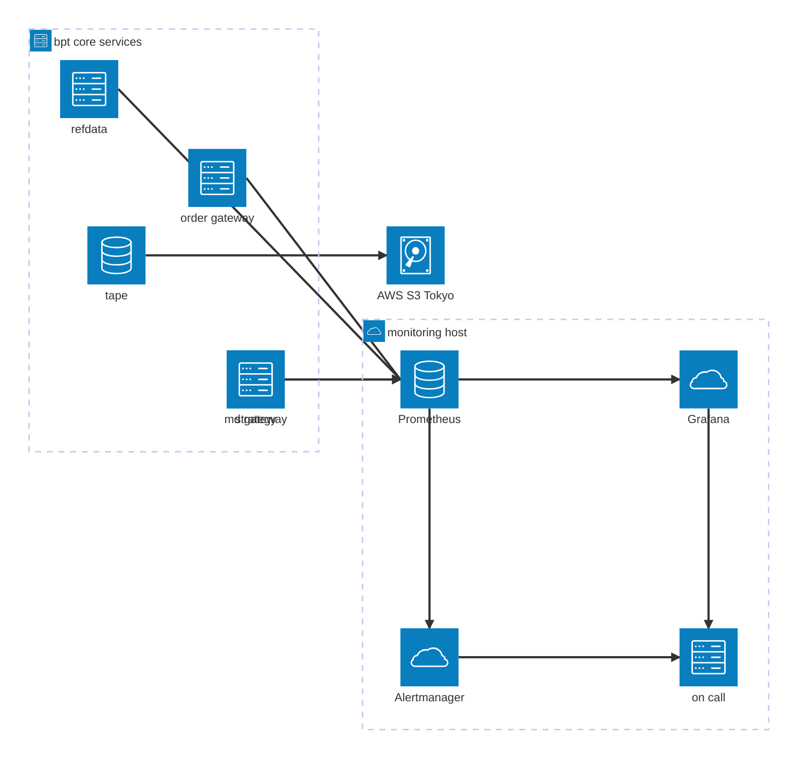

# bpt-core monitoring

Operational health monitoring for the bpt-core services. Prometheus scrapes
`bpt-refdata` / `bpt-md-gateway` / `bpt-order-gateway` directly on their metrics ports; Grafana
renders dashboards from Python source via [grafanalib](https://github.com/weaveworks/grafanalib).

This layer is **ops only** — service up/down, exchange connectivity,
order-ack latency, error counters. PnL / fills / order-book visualisation
live in the bpt-core React console, not here.

## Observability stack



## Layout

```
monitoring/
├── docker-compose.yml           # prometheus + grafana + loki
├── prometheus.yml               # scrape config, 5s interval
├── loki/loki.yml                # log aggregation config (7-day retention)
├── promtail/                    # per-host log shipper (bare-metal, not containerized)
│   ├── promtail.yml             # config template (env-expanded at runtime)
│   └── install.sh               # installs promtail + systemd unit on a host
├── provisioning/
│   ├── datasources/prometheus.yml
│   ├── datasources/loki.yml     # logs datasource w/ derived order_id / fill_id links
│   └── dashboards/bpt.yml       # file-based dashboard provider
├── dashboards/                  # grafanalib source (Python)
│   └── bpt_system_overview.dashboard.py
├── generated/                   # rendered dashboard JSON (gitignored)
├── Makefile
└── requirements.txt             # grafanalib
```

Dashboards are **design-as-code**: edits made in the Grafana UI are read-only
and get overwritten on next provisioning reload. To change a dashboard, edit
the `.dashboard.py` source and re-render.

## First-time setup

```bash
cd monitoring
make venv          # creates .venv and installs grafanalib
```

## Everyday workflow

```bash
make               # render all dashboards: dashboards/*.py → generated/*.json
make up            # bring up prometheus + grafana via docker-compose
make reload        # re-render + nudge Grafana to rescan provisioning
make down          # stop the stack
```

Grafana: <http://localhost:3000> (anonymous admin, no login form).
Prometheus: <http://localhost:9090>.

## Adding a dashboard

1. Create `dashboards/foo.dashboard.py`. The file **must** end in
   `.dashboard.py` and **must** define a module-level variable named
   `dashboard` — that's the naming convention grafanalib's
   `generate-dashboard` CLI uses to locate the definition.
2. `make` — grafanalib renders it to `generated/foo.json`.
3. `make reload` — Grafana's file provider picks it up within 30 s.

## Metric name conventions

| Service  | Port | Prefix        |
|----------|------|---------------|
| bpt-refdata   | 9101 | `refdata_`     |
| bpt-md-gateway   | 9102 | `bpt_md_gateway_`    |
| bpt-order-gateway | 9103 | `bpt_order_gateway_` |
| fenrir   | 9104 | *(no-op stub)* |

Fenrir's `metrics.h` is currently a no-op — no HTTP server is started and no
`fenrir_*` metrics are registered. Swap in the real prometheus-cpp
implementation before adding fenrir to any dashboard.

## Logs (Loki + promtail)

Metrics answer "is this service healthy" (Prometheus). Logs answer "what
actually happened" (Loki). Both flow to the same Grafana — different
datasources, same UI.

**Loki** runs in docker-compose alongside Prometheus + Grafana. Listens
on port 3100. Filesystem chunks, 7-day retention. Single-binary mode at
this scale — no Cassandra / Elasticsearch / S3 chunks until volume
demands it.

**Promtail** runs **bare-metal** on each bpt host (`trd`, `rec`, `mon`)
— NOT containerized, because reading the systemd journal cleanly from
a container is fiddly. Tails `bpt-*.service` units only (drops sshd /
snapd / systemd-logind noise), tags every line with `{host, role, env,
service, level}` labels.

### Installing promtail on a host

```bash
# On the operator workstation, copy the config + installer to the target:
scp -r monitoring/promtail ubuntu@<host>:/tmp/

# SSH in and install (per-host vars):
ssh ubuntu@<host>
sudo BPT_HOST_NAME=sg1-trd-test-01 \
     BPT_HOST_ROLE=trd \
     BPT_HOST_ENV=test \
     BPT_LOKI_URL=http://<monitor-host-tailscale-ip>:3100 \
     bash /tmp/promtail/install.sh
```

After install, verify shipping:

```bash
ssh ubuntu@<host>
journalctl -u promtail -n 20    # promtail's own log
curl -s ${BPT_LOKI_URL}/ready    # Loki reachable from this host
```

### Querying logs

Grafana → Explore → Loki datasource. Useful starting queries:

| Question | LogQL |
|---|---|
| All errors across services | `{level=~"err.*"}` |
| All events for one service | `{service="bpt-strategy"}` |
| One order's full lifecycle | `{} \|= "order_id=\"7643123\""` |
| Recent REJECTs with reason | `{service="bpt-order-gateway"} \|= "REJECT" \| json` |
| Per-host firehose | `{host="sg1-trd-test-01"}` |

Click any `order_id` / `fill_id` / `instrument_id` in a log row to filter
to that ID's trace — derived fields are wired in the datasource config.

### Architecture

```
ty1-trd-test-01 ───┐
                   │
ty1-rec-prod-01 ───┼─→ Tailscale ─→ ty1-mon-prod-01:3100 (Loki)
                   │                       │
ty1-mon-prod-01 ───┘                       │
                                           ↓
                                       Grafana
```

Loki port 3100 is reachable only via Tailscale (security group blocks
public). Push-based: each host's promtail initiates the TLS connection
outbound — no inbound holes on the trading host.

## Docker on WSL

If `docker compose up` fails with "command not found", you need Docker
Desktop's WSL integration enabled (Docker Desktop → Settings → Resources
→ WSL integration → toggle on for your distro), or install `docker-ce`
directly inside WSL.
