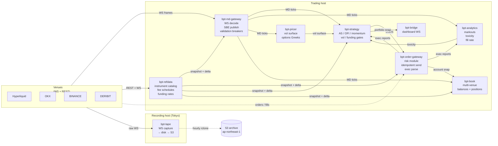

# Architecture

The stack is 8 long-running C++ services + 1 Java service (Aeron MediaDriver),
glued by Aeron IPC over shared memory. Each service is a `bpt::app::IService`
running under systemd, owning its hot threads, talking only via SBE-encoded
messages on named Aeron streams.

## Service topology

Solid arrows = Aeron streams (IPC, shared memory). Dotted = network or off-host.

## Key choices

The stack is opinionated. Each of these is documented separately under [Decisions](decisions/index.md):

- **Aeron over shared memory** for IPC — sub-microsecond latency, mature backpressure, MIT-licensed
- **SBE for wire format** — fixed-layout, zero-copy decode, schema-evolvable
- **Hexagonal boundaries** at the bus seam — every service exposes ports (`I*Subscriber`, `I*Publisher`); concrete Aeron bindings live in one factory per service
- **CRTP on the hot path** — `decoder → ValidatingPublisher<MdPublisher> → MdPublisher` is fully vtable-free
- **C++20 over Rust** — for the talent pool, FFI-free venue libraries, and tooling maturity at this point in time
- **systemd over Kubernetes** — solo operator, latency-sensitive workload, k8s overhead doesn't pay back
- **Testnet over paper-mode** — paper-mode was [removed](decisions/testnet-over-paper.md) after its model diverged from real adverse-selection

## Data flow on a typical tick

A Hyperliquid `l2Book` update arrives at the `bpt-md-gateway` adapter:

1. **WS read** in the adapter's IO thread. Raw bytes handed to `on_frame()`.
2. **JSON decode** via simdjson into a normalised `MdOrderBook` struct (no heap alloc — InlineVec for levels).
3. **Validation** — `MdValidator` checks for crossed book, price-deviation guards, monotonic ordering.
4. **CRTP publish** — `ValidatingPublisher<MdPublisher>::publish(book)` inlines straight into `MdPublisher::publish_orderbook()`.
5. **SBE encode + Aeron tryClaim** — encoder writes directly into Aeron's reserved buffer. No double copy.
6. **Strategy poll** — `bpt-strategy`'s `MdClient::poll()` consumes the fragment, dispatches to the active strategy's `on_orderbook()`.
7. **Decision + order** — strategy may emit a `NewOrder` SBE frame on the order-control stream.
8. **Risk gate** — `bpt-order-gateway`'s `RiskChecker` runs position cap, daily-loss latch, max-order-size, max-orders-per-second, duplicate-id checks. Pass → `OrderProcessor::on_new_order()` ships to the venue.
9. **Exec report** — venue WS exec response parsed by venue-specific `ExecDecoder`, normalised, published on the exec stream. Strategy + analytics see it.

End-to-end latency budget on this path is **single-digit microseconds**. The tape ([bpt-tape](services/tape.md)) sits off this path entirely — it taps the WS frame *before* the adapter's parse, so capture overhead is one extra `RawSpool::write_frame()` call per frame.

## Hosts

Currently:

| Host | Role | Stack |
|---|---|---|
| Laptop (dev) | Build + dev runs + research | All services + dashboard |
| Tokyo VPS (`ap-northeast-1`) | tape recording | `bpt-tape` only — no Aeron, no MediaDriver |

Planned:

| Host | Role |
|---|---|
| Tokyo trading | full live stack near HL matching engine |
| Singapore trading | full live stack near OKX |
| Backtester host | research replay; pulls Parquet from S3 on demand |
