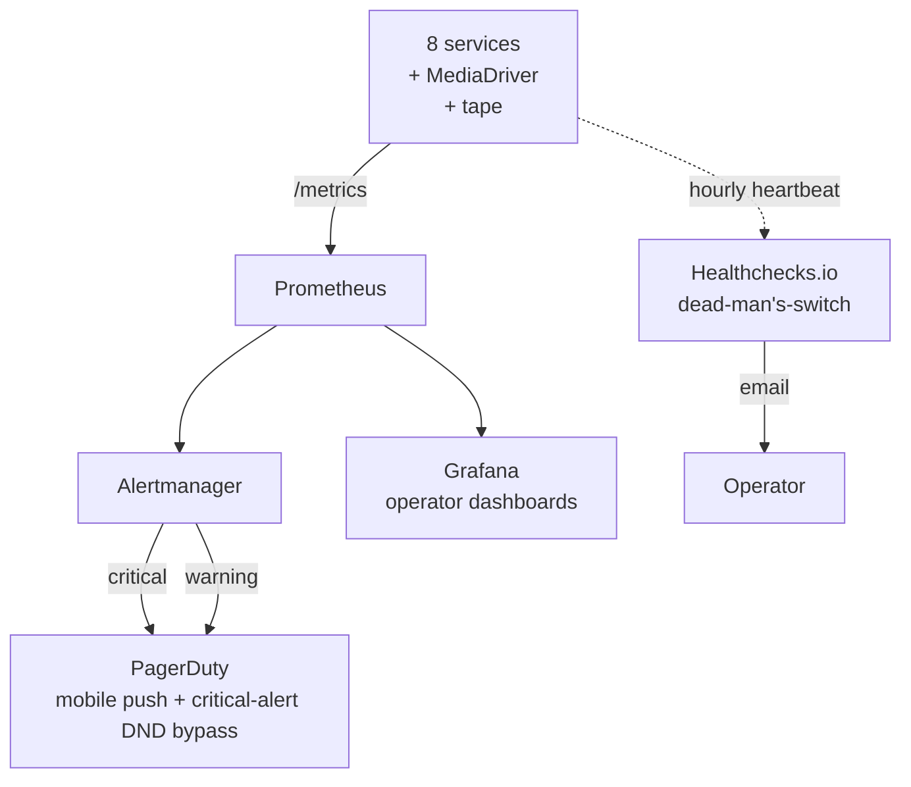

# Monitoring

Three layers, escalating severity:

## Layer 1: Prometheus + Grafana

Every service exposes `:metrics` (port from `[base].metrics_port` in the TOML
config). Prometheus scrapes; Grafana panels show:

- Per-venue WS connection state, exec-report latency p99, MD validation drop rate
- Per-strategy quote rate, fill rate, position, daily P&L
- Per-adapter circuit breaker state (validation drop, disconnect rate, reject rate)
- Risk module state (`risk_trading_enabled`, daily-loss latch, position cap utilisation)

Prometheus + Alertmanager + Grafana run via `monitoring/docker-compose.yml`
(separate from the trading stack — different lifecycle).

## Layer 2: Alertmanager → PagerDuty

13 PromQL rules in `monitoring/rules/bpt-alerts.yml`:

| Severity | Rule | Trigger |
|---|---|---|
| critical | `ServiceDown` | service.down for 2m |
| critical | `DailyLossLatch` | risk.trading_enabled == 0 due to PnL |
| critical | `RejectRateBreaker` | RejectRateBreaker tripped |
| critical | `DisconnectRateBreaker` | DisconnectRateBreaker tripped |
| critical | `ValidationDropBreaker` | per-adapter validation breaker tripped |
| critical | `StrategyHalted` | strategy went non-quoting unexpectedly |
| warning | `AdapterDisconnected` | per-venue WS disconnect for 30s |
| warning | `AccountSnapshotStale` | last AccountSnapshot > 60s old |
| warning | `StrategyPaused` | strategy paused for 60s |
| warning | `MDGatewayQuiet` | no MD ticks in 30s during market hours |
| warning | `RefdataStale` | refdata snapshot age > 1h |
| warning | `ReconciliationDivergence` | strategy ↔ exchange position diff > tolerance |
| warning | `HighLatencyP99` | exec-report p99 > 100 ms |

Alertmanager inhibit rules suppress redundant pages: `DailyLossLatch` inhibits
`RejectRateBreaker` (the latch already covered it); critical `ServiceDown`
inhibits same-service warnings.

PagerDuty integration via `pagerduty_configs:` with `routing_key_file:` mounted
into the Alertmanager container. Critical = repage with PD escalation; warning
= notify-only.

## Layer 3: Healthchecks.io dead-man's-switch

Alertmanager can't alert on its own process death. So:

- `bpt-heartbeat.timer` (5 min) → curls Healthchecks.io
- `bpt-recording-heartbeat.timer` (5 min, on recording host) → checks bpt-tape is active AND latest .wslog mtime is fresh, then pings

If 2 consecutive heartbeats are missed (15 min total silence), Healthchecks
emails the operator. Catches host-death scenarios that monitoring stack itself
can't.

## What gets validated end-to-end

- Synthetic alert injection via `curl -d '[{...}]' http://localhost:9093/api/v2/alerts` → confirmed phone push within 15-30s
- Real `ServiceDown` (kill -9 a service) → confirmed page
- Real `AdapterDisconnected` (block venue IP via iptables) → confirmed page
- Real `MDGatewayQuiet` (caught an actual silent-MD bug — root-caused to RunLoop async_read issue, worked around per-adapter)
